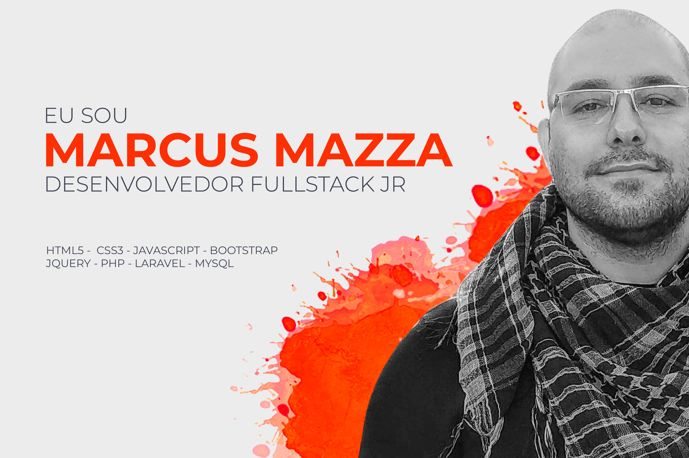

  

 

  <strong>Desenvolvedor Fullstack Jr. | JavaScript | jQuery | PHP | Laravel | MySQL | Git | GitHub</strong>

  Meu objetivo profissional é me tornar um desenvolvedor Full Stack referência na área e com domínio amplo de linguagens, engenharia e arquitetura de software.

  

    <h4>Tecnologias</h4>
  

  <!-- HTML 5 -->
  
  <!-- CSS3 -->
  
  <!-- Javasrcript -->
  
  <!-- PHP -->
  

  

    <h4>Frameworks / Bibliotecas</h4>
  

  <!-- JQuery -->
  
  <!-- React -->
  
  <!-- Bootstrap -->
    
  <!-- Laravel -->
  

